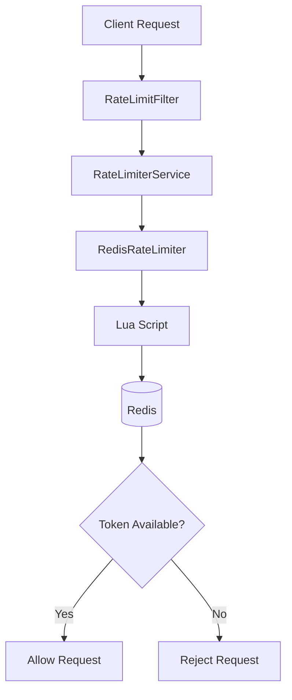

# 😾 Distributed Token Bucket Rate Limiter

A production-inspired distributed Token Bucket Rate Limiter built using **Spring Boot**, **Redis**, and **Redis Lua Scripting**.

The project started as an in-memory thread-safe implementation and was gradually evolved into a distributed rate limiter. During development, concurrent stress testing exposed race conditions in the Redis implementation. These were eliminated by executing the complete token bucket algorithm atomically using Redis Lua scripts.

---
## 🏗️ Architecture



## ✨ Features

-  Token Bucket Rate Limiting Algorithm
-  Thread-safe In-Memory Implementation
-  Distributed Rate Limiting using Redis
-  Redis Hash-based Bucket Storage
-  Atomic Token Consumption using Redis Lua Script
-  Per-user Rate Limiting
-  Spring Boot Filter Integration
-  Concurrent Stress Testing
-  Race Condition Detection & Resolution

---

## 🏗️ Tech Stack

- Java 23
- Spring Boot
- Spring Data Redis
- Redis
- Redis Lua Scripting
- Maven

---

# 📖 How It Works

Each user has an independent token bucket stored inside Redis.

Every incoming request follows this flow:

```text
Incoming Request
        │
        ▼
RateLimitFilter
        │
        ▼
RateLimiterService
        │
        ▼
RedisRateLimiter
        │
        ▼
Redis Lua Script
        │
        ▼
Read Bucket
        │
        ▼
Refill Tokens
        │
        ▼
Consume Token
        │
        ▼
Update Redis Atomically
        │
        ▼
Allow / Reject Request
```

---

# 🗂 Redis Bucket Structure

Each user bucket is stored as a Redis Hash.

```

rate-limit:user123

tokens : 7.4
lastRefillTime : 1751650671230

```

---

# ⚙️ Algorithm

1. Read bucket from Redis.
2. Calculate elapsed time.
3. Refill tokens.
4. Limit tokens to bucket capacity.
5. Consume one token if available.
6. Update bucket.
7. Return Allow / Reject.

---

# ⚡ Why Lua Script?

The initial Redis implementation used separate Redis commands:

```

GET Bucket
↓

Calculate
↓

SET Bucket

```

Although Redis is single-threaded, multiple clients can interleave between independent commands, causing race conditions.

The project now executes the entire Token Bucket algorithm inside a **single Redis Lua script**, making the complete operation atomic.

```

Java
      │
      ▼
Execute Lua Script
      │
      ▼
Redis (Atomic Execution)
      │
      ▼
Return Result

```

---

# 🧪 Concurrency Testing

A concurrent stress test was implemented using:

- ExecutorService
- CountDownLatch
- AtomicInteger

100 concurrent requests were fired against a bucket with:

```
Capacity = 10
Refill Rate = 0
```

### Before Lua

```
Allowed  : 14
Rejected : 86
```

### After Lua

```
Allowed  : 10
Rejected : 90
```

This verified that executing the Token Bucket algorithm atomically using Redis Lua scripting successfully eliminated race conditions.
# 📁 Project Structure

```

src
│
├── config
│
├── controller
│
├── filters
│
├── ratelimiter
│
├── service
│
├── resources
│ └── scripts
│ └── token_bucket.lua
│
└── test

```

---

# 🚀 Future Improvements

- Sliding Window Rate Limiter
- Dynamic Per-API Limits
- Metrics using Micrometer
- Prometheus Integration
- Grafana Dashboard
- Redis Cluster Support

---

# 👨‍💻 Developed By

Aryan Yadav
